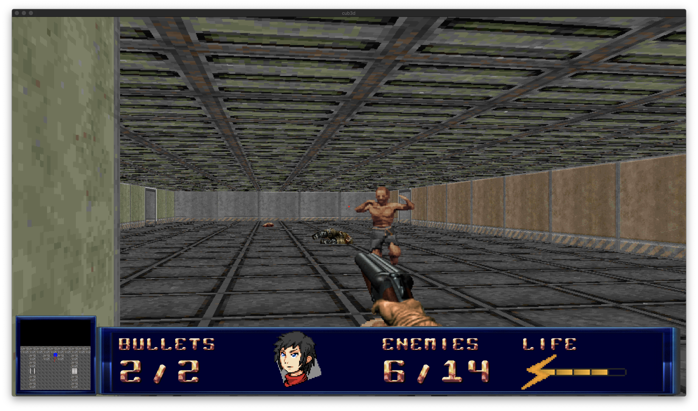
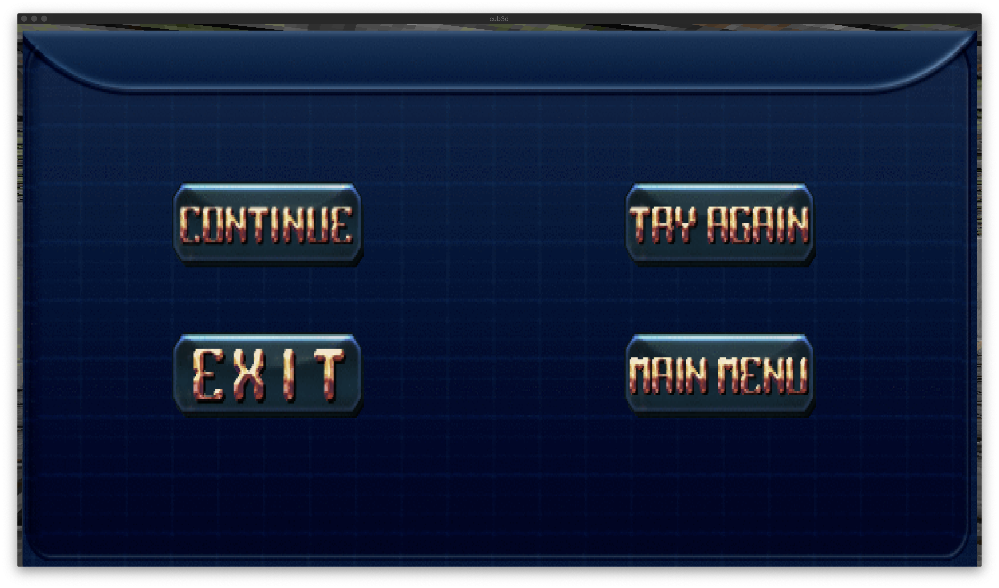

# cub3d

## About
This project is inspired from the game Wolfenstein3D, using a rendering technique called the RayCasting.  
The program reads a file given in parameter (or look for specific files if no files are given in the bonus section) and renders a 3D environment with the textures, colors and structure detailled in the file.

## RayCasting
The RayCasting is a solid and fast technique used for 3d rendering.

## Installation
Use `Make` in the bonus or mandatory folder and `./cub3d <file_name?>` to launch the program.

## Examples
### Game
</img>

### Menu
</img>

### File parsing example
</img>

### Video

